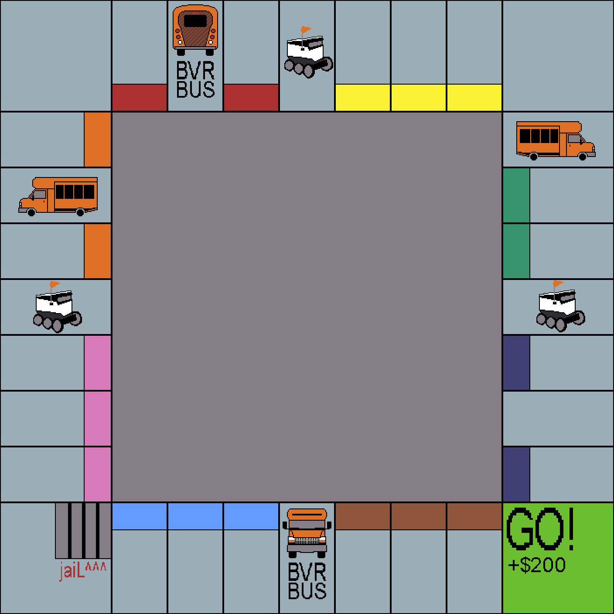

# kyles online multiplayer board game
its monopoly but only kyle can cheat  

made using pygame and sockets

this is what the board looks like right now

# run client

the client needs a server in order to run  
edit line 10 of **network.py**  

>self.server = "10.0.0.142"

and enter a valid server ip address.  
now you can run the client.

# run a local server

edit line 8 of **server.py**

> server = "10.0.0.142"

and enter the local ip address of the server.
